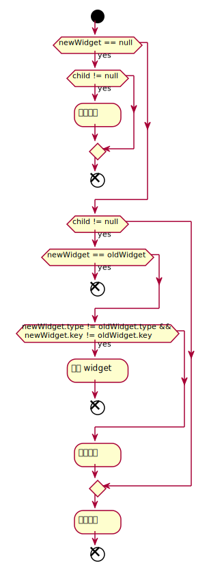

# Flutter UI 更新

## 入口

 `runApp` 的启动流程是触发界面绘制的入口之一。还有一个比较常见的触发界面刷新的入口是 `State#setState` 方法，这里主要就分析 `setState` 内部逻辑：

```dart
// State#setState
void setState(VoidCallback fn) {
    final dynamic result = fn() as dynamic;
    if (result is Future) {
        throw FlutterError("");
    }
    _element.markNeedsBuild();
}

// Element#markNeedsBuild
void markNeedsBuild() {
    if (!_active)
      return;
    if (dirty)
        return;
    _dirty = true;
    owner.scheduleBuildFor(this);
}
```

`setState` 的工作就是更新状态位，同时向 `BuildOwner` 说明自己需要被重建。这个 `BuildOwner` 控制视图树的更新，封装了 diff 算法。

## BuildOwner

`setState` 在简单状态位后就将剩下的工作交给了 `BuildOwner`，看下代码：

```dart
void scheduleBuildFor(Element element) {
    if (element._inDirtyList) {
        _dirtyElementsNeedsResorting = true;
        return;
    }
    if (!_scheduledFlushDirtyElements && onBuildScheduled != null) {
        _scheduledFlushDirtyElements = true;
        onBuildScheduled();     // 重点是这行
    }
    _dirtyElements.add(element);
    element._inDirtyList = true;
}
```

这里逻辑也非常简单的，将 `element` 添加到 `_dirtyelements` 中以等待重建，然后调用 `onBuildScheduled`，那这个 `onBuildScheduled` 属性又是在什么时候赋值的呢？ `WidgetsBinding` 在初始化时对 `BuildOwner#onBuildScheduled` 进行了赋值：

```dart
 mixin WidgetsBinding {
  void initInstances() {
        // ...
        buildOwner.onBuildScheduled = _handleBuildScheduled;
        // ...
    }
 }
```

所以调用 `BuildOwner#onBuildScheduled` 实际是调用的 `WidgetsBinding#_handleBuildScheduled`。接着函数调用往下看：

```dart
// WidgetsBinding
void _handleBuildScheduled() {
    ensureVisualUpdate();
}

// SchedulerBinding
void ensureVisualUpdate() {
    switch (schedulerPhase) {
        case SchedulerPhase.idle:
        case SchedulerPhase.postFrameCallbacks:
            scheduleFrame();
            return;
        case SchedulerPhase.transientCallbacks:
        case SchedulerPhase.midFrameMicrotasks:
        case SchedulerPhase.persistentCallbacks:
            return;
    }
}
void scheduleFrame() {
    if (_hasScheduledFrame || !_framesEnabled)
        return;
    ui.window.scheduleFrame();
    _hasScheduledFrame = true;
}
```

这里最终会调用到 `ui.window.scheduleFrame`，事实上调用流程到这里也就结束，不过最重要的也是这里，看下它的注释：

```dart
/// Requests that, at the next appropriate opportunity, the [onBeginFrame]
/// and [onDrawFrame] callbacks be invoked.
void scheduleFrame() native 'Window_scheduleFrame';
```

这是一个 native 方法，大概意思是 **通知引擎** 在合适的时候驱动界面刷新，具体是通过 `onBeginFrame` 和 `onDrawFrame` 完成的。

> 目前 Flutter/Dart 在调用 C++ 代码方面还没有官方的文档，但随着迭代后期肯定会有相应的工具出现

## SchedulerBinding

上一节知道了界面的更新最后会通过 `ui.window.onBeginFrame` 和 `ui.window.onDrawFrame` 触发，而这两个函数的赋值是在 `SchedulerBinding` 的初始化函数中完成的：

```dart
mixin SchedulerBinding {
    @override
    void initInstances() {
        // ...
        ui.window.onBeginFrame = _handleBeginFrame;
        ui.window.onDrawFrame = _handleDrawFrame;        
        // ...
    }
}
```

接着往下看会发现最终调用的是 `handleBeginFrame` 和 `handleDrawFrame`，即会调用 `WidgetsBinding#drawFrame` 方法

> 至于为什么是 `WidgetsBinding#drawFrame` 需要理解 Dart 的 mixin

## drawFrame

先看 `WidgetsBinding` 中的实现：

```dart
void drawFrame(){
    // ...
    buildOwner.buildScope(renderViewElement);
    super.drawFrame();
    buildOwner.finalizeTree();
    // ...
}
```

这里又回到了 `BuildOwner`，看看 `buildScope` 方法里头在更新界面方面所做的工作：

```dart
void buildScope(Element context, [VoidCallback callback]) {
    if (callback == null && _dirtyElements.isEmpty)
        return;
    try {
        _scheduledFlushDirtyElements = true;        // 表示正在处理 dirty 列表/构建控件
        if (callback != null) {
            _dirtyElementsNeedsResorting = false;
            callback();
        }
        _dirtyElements.sort(Element._sort);         // 进行排序，depth 小、dirty 的排在前面
        _dirtyElementsNeedsResorting = false;
        int dirtyCount = _dirtyElements.length;
        int index = 0;
        while (index < dirtyCount) {
            _dirtyElements[index].rebuild();        // 按序重建
            index += 1;
            // 下面是为防止在构建过程中有新的 dirty Element 插入
            if (dirtyCount < _dirtyElements.length || _dirtyElementsNeedsResorting) {
                _dirtyElements.sort(Element._sort);
                _dirtyElementsNeedsResorting = false;
                dirtyCount = _dirtyElements.length;
                while (index > 0 && _dirtyElements[index - 1].dirty) {
                    index -= 1;
                }
            }
        }
    } finally {
        for (Element element in _dirtyElements) {
            element._inDirtyList = false;
        }
        _dirtyElements.clear();
        _scheduledFlushDirtyElements = false;
        _dirtyElementsNeedsResorting = null;
    }
}
```

在分析 `RendererBinding#drawFrame` 之前先分析 `BuildOwner#finalizeTree` ：

```dart
void finalizeTree() {
    // ...
    lockState(() {
        _inactiveElements._unmountAll(); // this unregisters the GlobalKeys
    });
    // ...
}
```

这里就是将 `_inactiveElements` 进行清理，也就是说使用 `GlobalKeys` 缓存的控件只能被下一帧使用，然后就会被清理。

### Element#rebuild

上面如果点进 `Element.rebuild` 后发现代码实现和重建更新没啥关系，因为能够根据状态重建更新的只能是 **容器组件** 或 **根节点**，根节点的重建更新是由 `runApp` 触发的，容器组件的更新是由 `setState` 触发，所以下面看 `ComponentElement` (它是 `StatefulElement` 的父类) 中的实现：

```dart
// Element#rebuild
void rebuild() {
    if (!_active || !_dirty)
        return;
    performRebuild();
}
// ComponentElement#performRebuild
void performRebuild() {
    // ...
    Widget built = build();
    // ...
    _dirty = false;
    // ...
    _child = updateChild(_child, built, slot);
    // ...
}

// Element#updateChild
Element updateChild(Element child, Widget newWidget, dynamic newSlot) {
    if (newWidget == null) {
        if (child != null)
            deactivateChild(child);
        return null;
    }
    if (child != null) {
        if (child.widget == newWidget) {
            if (child.slot != newSlot)
                updateSlotForChild(child, newSlot);
            return child;
        }
        if (Widget.canUpdate(child.widget, newWidget)) {    // 对 runtimeType 和 key 进行比较，合理使用 key 也能提高性能（列表）
            if (child.slot != newSlot)
                updateSlotForChild(child, newSlot);
            child.update(newWidget);
            return child;
        }
        deactivateChild(child);
    }
    return inflateWidget(newWidget, newSlot);   // GlobalKey 的处理在这里
}
```

大致的更新逻辑就是这样，简单总结下： 1. newWidget == null，即 widget.build() == null 时返回 null；如果 child == null 则删除子树；流程结束 2. child == null（一般是 runApp 触发），递归地重建子树；结束流程 3. child != null && widget 没变化；不做更新；结束流程 4. child != null && widget 发生变化可以更新；结束流程 5. child != null && widget 发生变化不可更新；卸载子树；递归重建子树；结束流程



源码中使用表格进行表述：

|                   | **newWidget == null**               | **newWidget != null**                                        |
| ----------------- | ----------------------------------- | ------------------------------------------------------------ |
| **child == null** | Returns null.                       | Returns new [Element].                                       |
| **child != null** | Old child is removed, returns null. | Old child updated if possible, returns child or new [Element]. |

## PipelineOwner

回到 `PipelineOwner#drawFrame`：

```dart
void drawFrame() {
    pipelineOwner.flushLayout();
    pipelineOwner.flushCompositingBits();
    pipelineOwner.flushPaint();
    renderView.compositeFrame(); // this sends the bits to the GPU
    pipelineOwner.flushSemantics(); // this also sends the semantics to the OS.
}
```


```dart
void flushLayout() {
    while (_nodesNeedingLayout.isNotEmpty) {
        final List<RenderObject> dirtyNodes = _nodesNeedingLayout;
        _nodesNeedingLayout = <RenderObject>[];
        for (RenderObject node in dirtyNodes..sort((RenderObject a, RenderObject b) => a.depth - b.depth)) { // 根据 depth 排序
            if (node._needsLayout && node.owner == this)
                node._layoutWithoutResize();
        }
      }
}
// RenderObject
void _layoutWithoutResize() {
    performLayout();    // 这是个空方法，子类自己实现具体布局逻辑
    markNeedsSemanticsUpdate();
    _needsLayout = false;
    markNeedsPaint();   
}
void markNeedsPaint() {
    if (_needsPaint)
        return;
    _needsPaint = true;
    if (isRepaintBoundary) {
        if (owner != null) {
            owner._nodesNeedingPaint.add(this);
            owner.requestVisualUpdate();
        }
    } else if (parent is RenderObject) {
        final RenderObject parent = this.parent;
        parent.markNeedsPaint();
    } else {
        if (owner != null)
            owner.requestVisualUpdate();
    }
}
```

这里有个新的概念：**重绘边界** ， `flushLayout` 会尝试将布局边界添加到重绘列表中，如果没找到就会将根结点加入，也就是说设置布局边界可以避免全量重绘。同理，还有一个 **布局边界**，也能起到减少布局的开销。

## 简单总结

`setState` 会将 `Element` 设置 dirty，然后通知引擎需要重新布局等，之后的操作和启动第一帧上屏就是一样的了。看到这里也能理解为什么第一帧上屏和常规的界面更新会有不一样的地方了，因为常规更新只会触发状态位更新而不会立即更新，直到下一次 VSync 信号到来之时才能开始刷新。