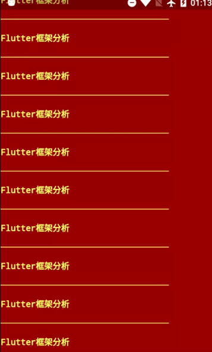
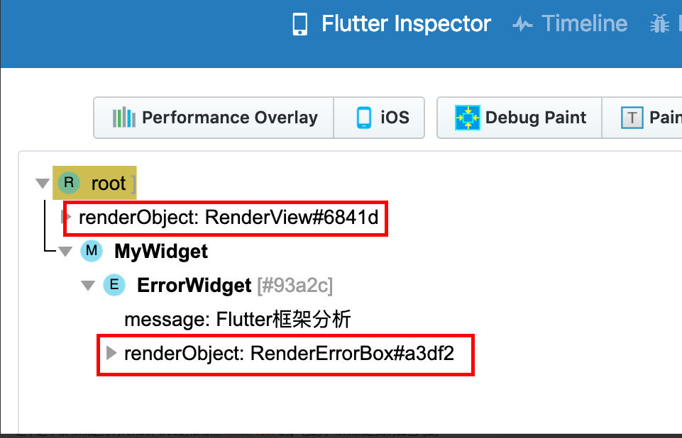
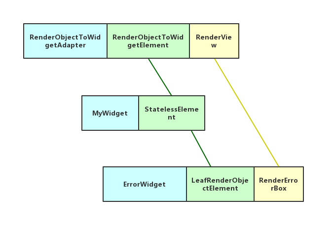

# Widget-Element-RenderObject-2

对Flutter app开发者来说比较重要的`Widget`，`Element`和`RenderObject`体系。Flutter的理念是一切都是`Widget`(Everythin is Widget)。开发者在开发Flutter app的时候主要都是在写很多`Widget`。那么这三者之间是什么关系？它们是怎么工作的呢？让我们来一探究竟。

## 概览

这块的内容比较多且有些复杂，为了不让大家迷失在源码的海洋里，我们还是举个例子先简单了解一下这个体系。

```
void main() {
  runApp(MyWidget());
}

class MyWidget extends StatelessWidget {
  final String _message = "Flutter框架分析";
  @override
  Widget build(BuildContext context) => ErrorWidget(_message);
}

```

这个例子的利用Flutter自带的`ErrorWidget`显示我们自定义的一句话：“Flutter框架分析”。没错，这个`ErrorWidget`就是当你的代码出bug的时候显示在屏幕上的可怕的红底黄字信息。放张截屏大家感受一下。





这里使用它是因为它是最简单，层级最少的一个`Widget`。以方便我们理解Flutter框架，避免被`MaterialApp`那深不可测的element tree和render tree劝退。

运行上述例子以后再打开Flutter Inspector看一下：




 从上图可见就三个层级 root->

```
MyWidget
```

->

```
ErrorWidget
```

。这看起来是个widget tree。这里的root对应的是上篇文章里说的

```
RenderObjectToWidgetAdapter
```

。但这实际上是这样的一个element tree：

```
RenderObjectToWidgetElement
```

->

```
StatelessElement
```

->

```
LeafRenderObjectElement
```

。还记得我们上篇文章里说的，

```
RenderObjectToWidgetElement
```

是element tree的根节点。看看图中上方红框，这个根节点是持有render tree的根节点

```
RenderView
```

的。它的子节点就是我们自己写的

```
MyWidget
```

对应的

```
StatelessElement
```

。而这个element是不持有

```
RenderObject
```

的。只有最下面的

```
ErrorWidget
```

对应的

```
LeafRenderObjectElement
```

才持有第二个

```
RenderObject
```

。所以 render tree是只有两层的: 

```
RenderView
```

->

```
RenderErrorBox
```

。以上所说用图来表示就是这样的：




 图中绿色连接线表示的是element tree的层级关系。黄色的连接线表示render tree的层级关系。


从上面这个例子可以看出来，`Widget`是用来描述对应的`Element`的描述或配置。`Element`组成了element tree，`Element`的主要功能就是维护这棵树，节点的增加，删除，更新，树的遍历都在这里完成。`Element`都是从`Widget`中生成的。每个`Widget`都会对应一个`Element`。但是并非每个`Widget`/`Element`会对应一个`RenderObject`。只有这个`Widget`继承自`RenderObjectWidget`的时候才会有对应的`RenderObject`。

总的来说就是以下几点：

- `Widget`是对`Element`的配置或描述。Flutter app开发者主要的工作都是在和`Widget`打交道。我们不需要关心树的维护更新，只需要专注于对`Widget`状态的维护就可以了，大大减轻了开发者的负担。
- `Element`负责维护element tree。`Element`不会去管具体的颜色，字体大小，显示内容等等这些UI的配置或描述，也不会去管布局，绘制这些事，它只管自己的那棵树。`Element`的主要工作都处于渲染流水线的构建（build）阶段。
- `RenderObject`负责具体布局，绘制这些事情。也就是渲染流水线的布局（layout）和 绘制（paint）阶段。

接下来我们就结合源码，来分析一下`Widget`，`Element`和`RenderObject`。

## Widget

基类`Widget`很简单

```
@immutable
abstract class Widget extends DiagnosticableTree {

  const Widget({ this.key });
  ...
  @protected
  Element createElement();
  ...
}
```

方法`createElement()`负责实例化对应的`Element`。由其子类实现。接下来看下几个比较重要的子类：

### StatelessWidget

```
abstract class StatelessWidget extends Widget {
  /// Initializes [key] for subclasses.
  const StatelessWidget({ Key key }) : super(key: key);
  
  @override
  StatelessElement createElement() => StatelessElement(this);

  @protected
  Widget build(BuildContext context);
}
```

`StatelessWidget`对Flutter开发者来讲再熟悉不过了。它的`createElement`方法返回的是一个`StatelessElement`实例。

`StatelessWidget`没有生成`RenderObject`的方法。所以`StatelessWidget`只是个中间层，它需要实现`build`方法来返回子`Widget`。

### StatefulWidget

```
abstract class StatefulWidget extends Widget {
  @override
  StatefulElement createElement() => StatefulElement(this);

  @protected
  State createState();
}
```

`StatefulWidget`对Flutter开发者来讲非常熟悉了。`createElement`方法返回的是一个`StatefulElement`实例。方法`createState()`构建对应于这个`StatefulWidget`的`State`。

`StatefulWidget`没有生成`RenderObject`的方法。所以`StatefulWidget`也只是个中间层，它需要对应的`State`实现`build`方法来返回子`Widget`。

#### State

说到`StatefulWidget`就不能不说说`State`。

```
abstract class State<T extends StatefulWidget> extends Diagnosticable {
  T get widget => _widget;
  T _widget;
  
  BuildContext get context => _element;
  StatefulElement _element;

  bool get mounted => _element != null;

  void initState() { }

  void didUpdateWidget(covariant T oldWidget) { }

  void setState(VoidCallback fn) {
    final dynamic result = fn() as dynamic;
    _element.markNeedsBuild();
  }

  void deactivate() { }
  
  void dispose() { }

  Widget build(BuildContext context);

  void didChangeDependencies() { }
}
```

从源码可见，`State`持有对应的`Widget`和`Element`。注意这一句`BuildContext get context => _element;`。我们在调用`build`时候的入参`BuildContex`其实返回的就是`Element`。

`mounted`，用来判断这个`State`是不是关联到element tree中的某个`Element`。如果当前`State`不是在`mounted == true`的状态，你去调用`setState()`是会crash的。

函数`initState()`用来初始化`State`。

函数`didUpdateWidget(covariant T oldWidget)`在这个`State`被换了个新的`Widget`以后被调用到。是的，`State`对应的`Widget`实例只要是相同类型的是可以被换来换去的。

函数`setState()`我们很熟悉了。这个函数只是简单执行传入的回调然后调用`_element.markNeedsBuild()`。你看，如果此时`_element`为空的时候会不会出问题？所以建议大家在调用`setState()`之前用`mounted`判断一下。另外要注意的一点是，这个函数也是触发渲染流水线的一个点。后续我会在另外的文章里从这个点出发，给大家说说渲染流水线如何在`Widget`、`Element`和`RenderObject`架构下运行。

函数`deactivate()`在`State`对应的`Element`被从树中移除后调用，这个移除可能是暂时移除。

函数`dispose()`在`State`对应的`Element`被从树中移除后调用，这个移除是永久移除。

函数`build(BuildContext context)`，大家很熟悉了，不多说了。

函数`didChangeDependencies()`，`State`的依赖发生变化的时候被调用，具体什么样的依赖后文再说。

`StatefullWidget`和`State`对Flutter app开发者来说可能会是打交道最多的。有些细节还需要结合`Element`做深入的理解。

### InheritedWidget

`InheritedWidget`既不是`StatefullWidget`也不是`StatelessWidget`。它是用来向下传递数据的。在`InheritedWidget`之下的子节点都可以通过调用`BuildContext.inheritFromWidgetOfExactType()`来获取这个`InheritedWidget`。它的`createElement()`函数返回的是一个`InheritedElement`。

```
abstract class InheritedWidget extends ProxyWidget {
  const InheritedWidget({ Key key, Widget child })
    : super(key: key, child: child);

  @override
  InheritedElement createElement() => InheritedElement(this);

  @protected
  bool updateShouldNotify(covariant InheritedWidget oldWidget);
}
```

### RenderObjectWidget

`RenderObjectWidget`用来配置`RenderObject`。其`createElement()`函数返回`RenderObjectElement`。由其子类实现。相对于上面说的其他`Widget`。这里多了一个`createRenderObject()`方法。用来实例化`RenderObject`。

```
abstract class RenderObjectWidget extends Widget {

  const RenderObjectWidget({ Key key }) : super(key: key);

  @override
  RenderObjectElement createElement();

  @protected
  RenderObject createRenderObject(BuildContext context);

  @protected
  void updateRenderObject(BuildContext context, covariant RenderObject renderObject) { }

  @protected
  void didUnmountRenderObject(covariant RenderObject renderObject) { }
}
```

`RenderObjectWidget`只是个配置，当配置发生变化需要应用到现有的`RenderObject`上的时候，Flutter框架会调用`updateRenderObject()`来把新的配置设置给相应的`RenderObject`。

`RenderObjectWidget`有三个比较重要的子类：

- `LeafRenderObjectWidget`这个`Widget`配置的节点处于树的最底层，它是没有孩子的。对应`LeafRenderObjectElement`。
- `SingleChildRenderObjectWidget`，只含有一个孩子。对应`SingleChildRenderObjectElement`。
- `MultiChildRenderObjectWidget`，有多个孩子。对应`MultiChildRenderObjectElement`。

## Element

`Element`构成了element tree。这个类主要在做的事情就是维护这棵树。 从上面对`Widget`的分析我们可以看出，好像每个特别的`Widget`都会有一个对应的`Element`。特别是对于`RenderObjectWidget`。如果我有一个`XXXRenderObjectWidget`，它的`createElement()`通常会返回一个`XXXRenderObjectElement`。为简单起见。我们的分析就仅限于比较基础的一些`Element`。 首先来看一下基类`Element`。

```
abstract class Element extends DiagnosticableTree implements BuildContext {
    Element _parent;
    Widget _widget;
    BuildOwner _owner;
    dynamic _slot;
    
    void visitChildren(ElementVisitor visitor) { }
    
    Element updateChild(Element child, Widget newWidget, dynamic newSlot) {
        
    }
    
    void mount(Element parent, dynamic newSlot) {
        
    }
    
    void unmount() {
         
    }
    
    void update(covariant Widget newWidget) {
        
    }
    
    @protected
    Element inflateWidget(Widget newWidget, dynamic newSlot) {
    ...
      final Element newChild = newWidget.createElement();
      newChild.mount(this, newSlot);
      return newChild;
    }
  
    void markNeedsBuild() {
      if (dirty)
        return;
      _dirty = true;
      owner.scheduleBuildFor(this);
    }
    
    void rebuild() {
      if (!_active || !_dirty)
        return;
      performRebuild();
    }
  
    @protected
    void performRebuild();
}
```

`Element`持有当前的`Widget`，一个`BuildOwner`。这个`BuildOwner`是之前在`WidgetsBinding`里实例化的。`Element`是树结构，它会持有父节点`_parent`。`_slot`由父`Element`设置，目的是告诉当前`Element`在父节点的什么位置。由于`Element`基类不知道子类会如何管理孩子节点。所以函数`visitChildren()`由子类实现以遍历孩子节点。

函数`updateChild()`比较重要，用来更新一个孩子节点。更新有四种情况：

- 新`Widget`为空，老`Widget`也为空。则啥也不做。
- 新`Widget`为空，老`Widget`不为空。这个`Element`被移除。
- 新`Widget`不为空，老`Widget`为空。则调用`inflateWidget()`以这个`Wiget`为配置实例化一个`Element`。
- 新`Widget`不为空，老`Widget`不为空。调用`update()`函数更新子`Element`。`update()`函数由子类实现。

新`Element`被实例化以后会调用`mount()`来把自己加入element tree。要移除的时候会调用`unmount()`。

函数`markNeedsBuild()`用来标记`Element`为“脏”(dirty)状态。表明渲染下一帧的时候这个`Element`需要被重建。

函数`rebuild()`在渲染流水线的构建（build）阶段被调用。具体的重建在函数`performRebuild()`中，由`Element`子类实现。

`Widget`有一些比较重要的子类，对应的`Element`也有一些比较重要的子类。

### ComponentElement

`ComponentElement`表示当前这个`Element`是用来组合其他`Element`的。

```
abstract class ComponentElement extends Element {
  ComponentElement(Widget widget) : super(widget);

  Element _child;

  @override
  void performRebuild() {
    Widget built;
    built = build();
    _child = updateChild(_child, built, slot);
  }

  Widget build();
}
```

`ComponentElement`继承自`Element`。是个抽象类。`_child`是其孩子。在函数`performRebuild()`中会调用`build()`来实例化一个`Widget`。`build()`函数由其子类实现。

### StatelessElement

`StatelessElement`对应的`Widget`是我们熟悉的`StatelessWidget`。

```
class StatelessElement extends ComponentElement {

  @override
  Widget build() => widget.build(this);

  @override
  void update(StatelessWidget newWidget) {
    super.update(newWidget);
    _dirty = true;
    rebuild();
  }
}
```

其`build()`函数直接调用的就是`StatelessWidget.build()`。现在你知道你写在`StatelessWidget`里的`build()`是在哪里被调用的了吧。而且你看，`build()`函数的入参是`this`。我们都知道这个函数的入参应该是`BuildContext`类型的。这个入参其实就是这个`StatelessElement`。

### StatefulElement

`StatefulElement`对应的`Widget`是我们熟悉的`StatefulWidget`。

```
class StatefulElement extends ComponentElement {
  /// Creates an element that uses the given widget as its configuration.
  StatefulElement(StatefulWidget widget)
      : _state = widget.createState(),
        super(widget) {
    _state._element = this;
    _state._widget = widget;
  }

  @override
  Widget build() => state.build(this);
  
   @override
  void _firstBuild() {
    final dynamic debugCheckForReturnedFuture = _state.initState() 
    _state.didChangeDependencies();
    super._firstBuild();
  }

  @override
  void deactivate() {
    _state.deactivate();
    super.deactivate();
  }

  @override
  void unmount() {
    super.unmount();
    _state.dispose();
    _state._element = null;
    _state = null;
  }

  @override
  void didChangeDependencies() {
    super.didChangeDependencies();
    _state.didChangeDependencies();
  }
}
```

在`StatefulElement`构造的时候会调用对应`StatefulWidget`的`createState()`函数。也就是说`State`是在实例化`StatefulElement`的时候被实例化的。并且`State`实例会被这个`StatefulElement`实例持有。从这里也可以看出为什么`StatefulWidget`的状态要由单独的`State`管理，每次刷新的时候可能会有一个新的`StatefulWidget`被创建，但是`State`实例是不变的。

`build()`函数调用的是我们熟悉的`State.build(this)`，现在你也知道了`State`的`build()`函数是在哪里被调用的了吧。而且你看，`build()`函数的入参是`this`。我们都知道这个函数的入参应该是`BuildContext`类型的。这个入参其实就是这个`StatefulElement`。

我们都知道State有状态，当状态改变时对应的回调函数会被调用。这些回调函数其实都是在`StatefulElement`里被调用的。

在函数`_firstBuild()`里会调用`State.initState()`和`State.didChangeDependencies()`。

在函数`deactivate()`里会调用`State.deactivate()`。

在函数`unmount()`里会调用`State.dispose()`。

在函数`didChangeDependencies()`里会调用`State.didChangeDependencies()`。

### InheritedElement

`InheritedElement`对应的`Widget`是`InheritedWidget`。其内部实现主要是在维护对其有依赖的子`Element`的`Map`，以及在需要的时候调用子`Element`对应的`didChangeDependencies()`回调，这里就不贴代码了，大家感兴趣的话可以自己去看一下源码。

### RenderObjectElement

`RenderObjectElement`对应的`Widget`是`RenderObjectWidget`。

```
abstract class RenderObjectElement extends Element {
  RenderObject _renderObject;
  
  @override
  void mount(Element parent, dynamic newSlot) {
    super.mount(parent, newSlot);
    _renderObject = widget.createRenderObject(this);
    attachRenderObject(newSlot);
    _dirty = false;
  }
  
  @override
  void unmount() {
    super.unmount();
    widget.didUnmountRenderObject(renderObject);
  }
  
  @override
  void update(covariant RenderObjectWidget newWidget) {
    super.update(newWidget);
    widget.updateRenderObject(this, renderObject);
    _dirty = false;
  }
  
  @override
  void performRebuild() {
    widget.updateRenderObject(this, renderObject);
    _dirty = false;
  }
  
  @protected
  void insertChildRenderObject(covariant RenderObject child, covariant dynamic slot);

  @protected
  void moveChildRenderObject(covariant RenderObject child, covariant dynamic slot);

  @protected
  void removeChildRenderObject(covariant RenderObject child);

}
```

函数`mount()`被调用的时候会调用`RenderObjectWidget.createRenderObject()`来实例化`RenderObject`。

函数`update()`和`performRebuild()`被调用的时候会调用`RenderObjectWidget.updateRenderObject()`。

函数`unmount()`被调用的时候会调用`RenderObjectWidget.didUnmountRenderObject()`。

## RenderObject

`RenderObject`负责渲染流水线布局（layout）阶段和绘制（paint）阶段的工作。同时也维护render tree。对render tree的维护方法是来自基类`AbstractNode`。这里我们主要关注和渲染流水线相关的一些方法。

```
abstract class RenderObject extends AbstractNode with DiagnosticableTreeMixin implements HitTestTarget {

  void markNeedsLayout() {
      ...
  }
  
  void markNeedsPaint() {
      ...
  }
  
  void layout(Constraints constraints, { bool parentUsesSize = false }) {
    ...  
    if (sizedByParent) {
        performResize();
    }
    ...
    performLayout();
    ...
  }
  
  void performResize();
  
  void performLayout();
  
  void paint(PaintingContext context, Offset offset) { }
}
```

`markNeedsLayout()`标记这个`RenderObject`需要重新做布局。`markNeedsPaint`标记这个`RenderObject`需要重绘。这两个函数只做标记。标记之后Flutter框架会调度一帧，在下一个Vsync信号到来之后才真正做布局和绘制。

真正的布局在函数`layout()`中进行。这个函数会做一次判断，如果`sizedByParent`为`true`。则会调用`performResize()`。表明这个`RenderObject`的尺寸仅由其父节点决定。然后会调用`performLayout()`做布局。`performResize()`和`performLayout()`都需要`RenderObject`的子类去实现。`

## 总结

`Widget`，`Element`和`RenderObject`体系是Flutter框架的核心。其中`Element`需要好好理解。Flutter的渲染流水线中的构建（build）阶段主要就是在维护更新element tree里面的`Element`节点。