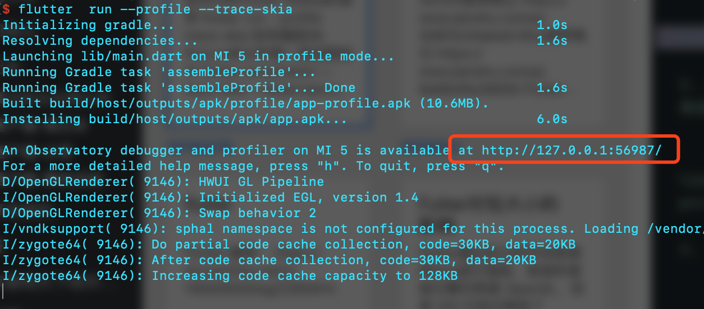
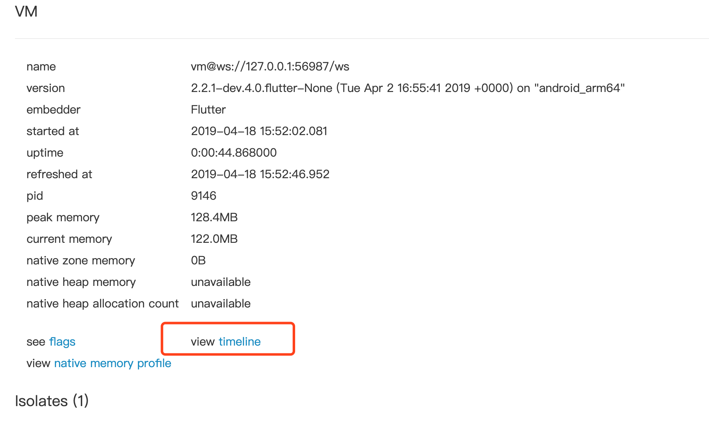
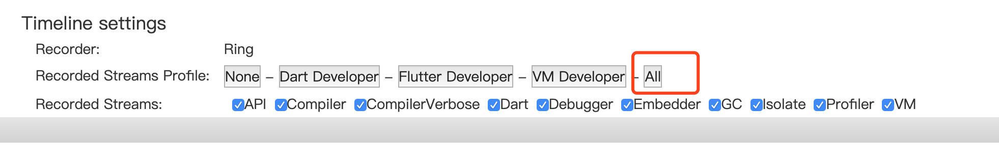
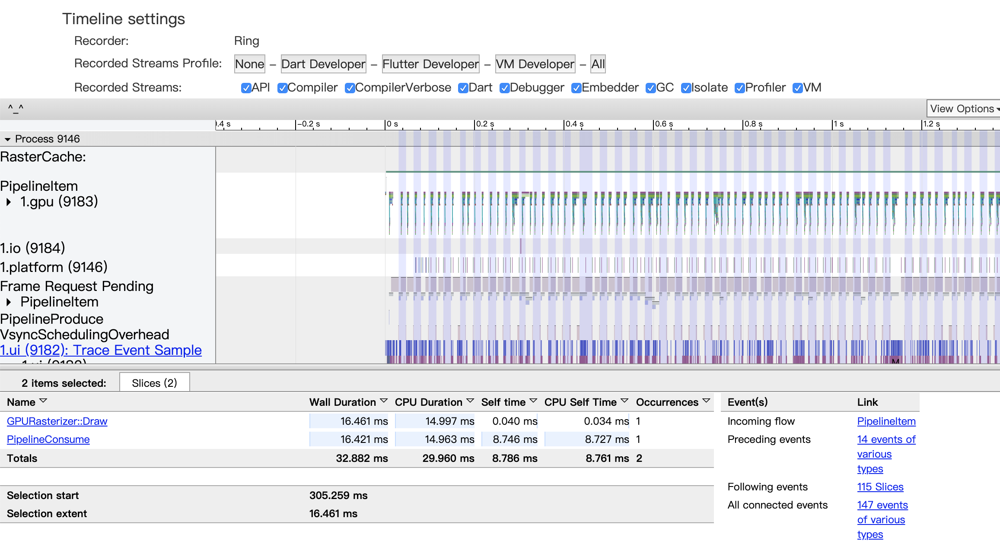
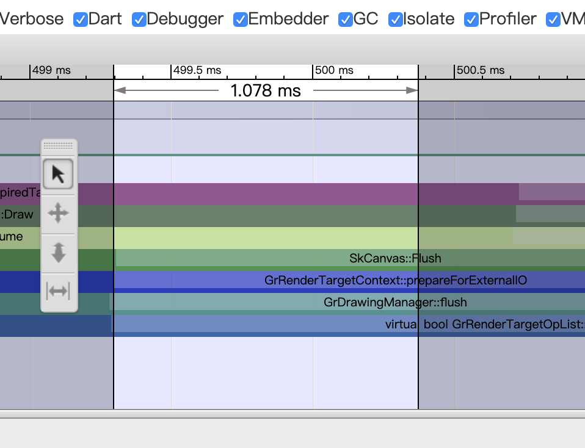
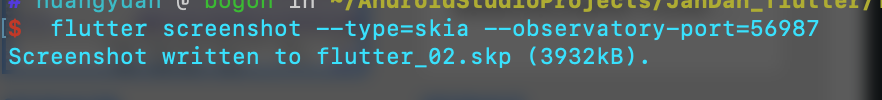
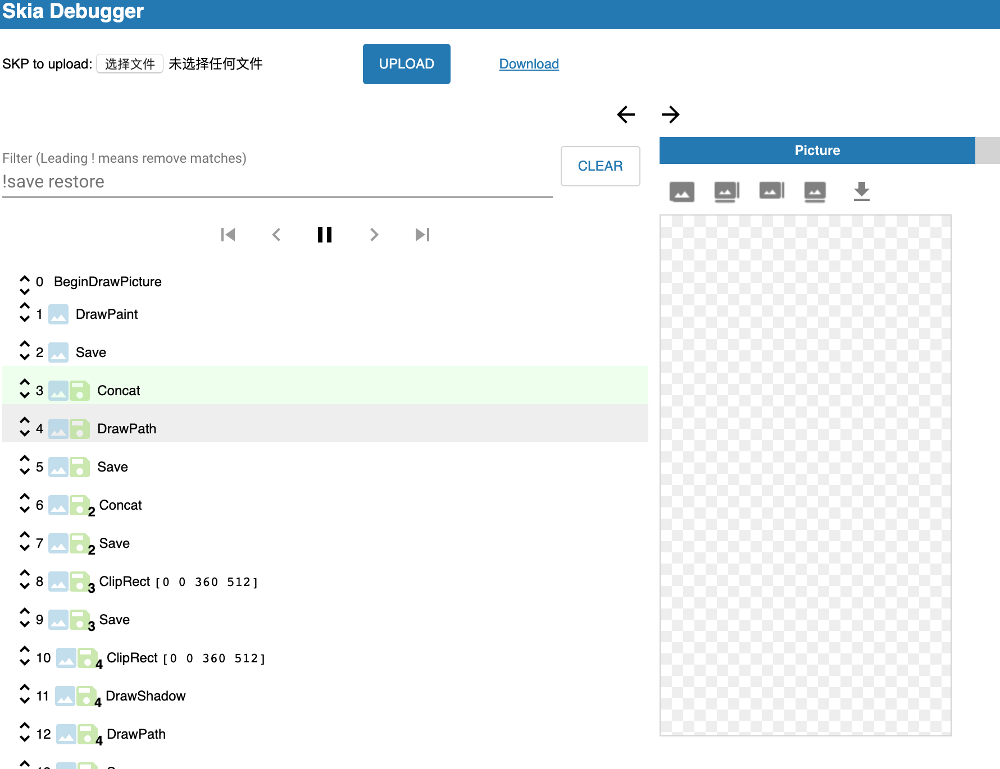

# flutter performance

#### 如何分析Flutter 对Skia的调用

```
flutter run --profile --trace-skia
```



**可在浏览器中查看**
打开上图的中地址



**全选一下**



**操作一下应用，然后点击浏览器又上角Refresh**



这里可以看到最底层的skia函数调用情况。
很多同学问怎么放大函数调用的时间区域(把时间线加长)

这里有四个选项，
第一个是选择区域，当你选中这个选项，然后按住鼠标左键在时间线上选择，就可以选中一段时间，和PS中的区域选择工具很像。
第二个是移动区域，当你选中这个选项，然后按住鼠标左键在下面有颜色的地方拖动，就可以拖动时间线
第三个是放大缩小，当你选中这个选项，然后按住鼠标左键在下面有颜色的地方向上拖动是放大，向下拖动是缩小。
第四个是区域选择，当你选中这个选项，然后按住鼠标左键在下面有颜色的地方拖动，可以统计选择的区域总共是多长时间。

#### 如何捕捉SK Picture来分析每一条绘图指令

**接上一步**

这里的port是我们在浏览器中查看的端口

```
flutter screenshot --type=skia --observatory-port=<port>
```



这里会生成一个skp文件，文件可以在<https://debugger.skia.org/> 这里进行分析。如果网络不好的话可以在本地起一个服务，需要自己编译一下skia。

**需fq**

1. 下载depot_tools并设置环境变量

```
git clone 'https://chromium.googlesource.com/chromium/tools/depot_tools.git'
export PATH="${PWD}/depot_tools:${PATH}"
```

1. 下载skia并且更新

   ```
   git clone https://skia.googlesource.com/skia.git 
   cd skia 
   python tools/git-sync-deps
   ```

2. 编译

使用GN生成构建文件

```
bin/gn gen out/Static --args='is_official_build=true' 
bin/gn gen out/Shared --args='is_official_build=true is_component_build=true'
```

GN也支持更细粒度的配置

```
bin/gn gen out/Debug 
bin/gn gen out/Release --args='is_debug=false' 
bin/gn gen out/Clang --args='cc="clang" cxx="clang++"' 
bin/gn gen out/Cached --args='cc_wrapper="ccache"' 
bin/gn gen out/RTTI --args='extra_cflags_cc=["-frtti"]'
```

1. 编译并启动本地服务

```
# Build. 
ninja -C out/Release skiaserve 
# Run the debugger locally 
# By default the address will be 
# http://127.0.0.1:8888 
out/Release/skiaserve
```

skia编译教程<https://skia.org/dev/tools/debugger>
选择上一步导出的spk文件并上传，

[](images/skia_debugger.png)

可以分析每一步进行了哪些操作，有哪些重复绘制

#### 常见Skia函数调用性能瓶颈

saveLayer、clipPath 函数
基本都是flutter自己的控件调用的


